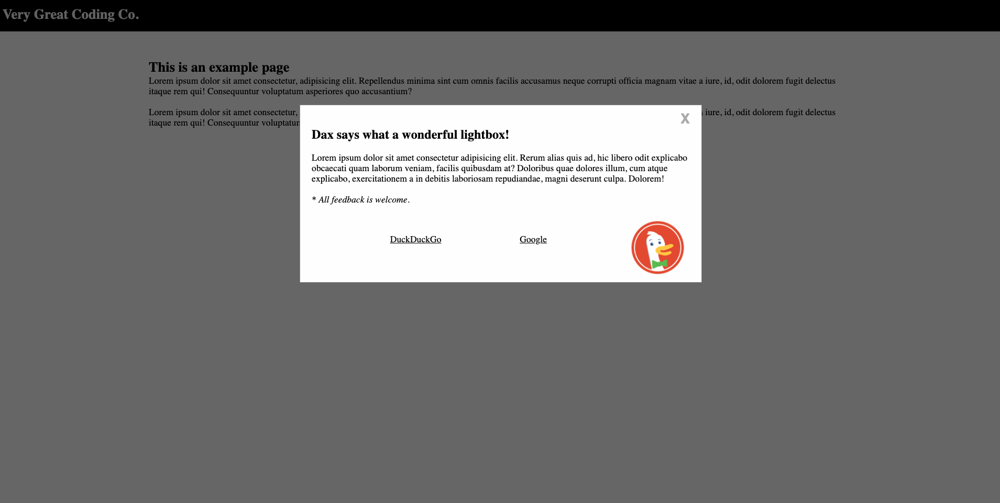

# Lightbox.js

Just a really simple plug-n-play lightbox I have made from the ground up.  Initially used on <a href="https://usadinnerwaredirect.com" target="_blank" rel="noopener">USA Dinnerware Direct</a> but will be used on other sites. Use your site or theme CSS to customize the lightbox, this is just the starter skeleton.  

## Initial Features
<ul>
    <li> 3.5 second (3500ms) delay before it appears </li>
    <li> Shows/hides lightbox depending on if the user has visited already within the last 24 hours via local storage </li>
    <li> Custom message in console </li>
</ul>